# Optimizing an ML Pipeline in Azure

## Overview
This project is part of the Udacity Azure ML Nanodegree.
In this project, we build and optimize an Azure ML pipeline using the Python SDK and a provided Scikit-learn model.
This model is then compared to an Azure AutoML run.

## Summary

The dataset used in these experiments is a subset of the datafile available online in Kaggle - https://www.kaggle.com/datasets/henriqueyamahata/bank-marketing and contains data about direct marketing campaigns (phone calls) of a Portuguese banking institution. The objective is to predict if the client will subscribe a term deposit (variable y), using attributes like age, job, education,etc.
So, this is a classification task to predict the last column of the dataset, "y", having the possible values yes or no:

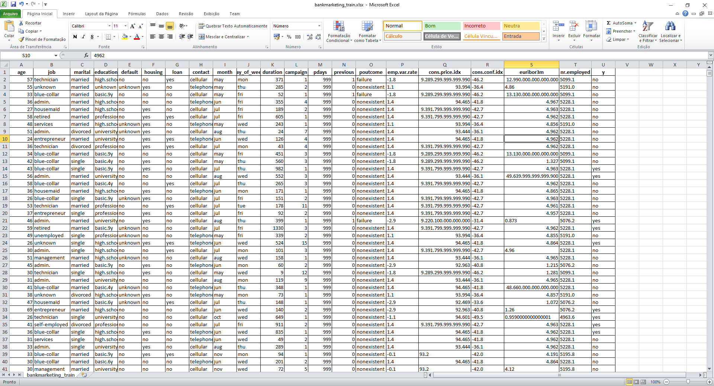

To solve the problem, two different pipelines were applied: one using Hyperdrive to tuning the hyperparameters of a SkLearn LogisticRegression algorithm, and another using AutoML, exploring multiple machine learning algorithms on the same dataset. 

The best performance model was obtained using AutoML with a VotingEnsemble of 7 classifiers.

## Initial data exploration

There are 32.950 rows in the csv file, and the training procedure starts removing the rows with null values (dropna) and uses one-hot-encoding for categorical attributes, including the class (encoded as 0 or 1) before start the training.
After the cleaning, the number of rows is mantained (32.950). 
The initial data exploration detected a class imbalance in the dataset, with only 11.20% (3692 registers) of the data belonging to class yes (1):

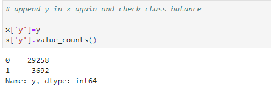

To get a baseline performance for this classification task, the LogisticRegression of SkLearn is executed with default parameters, resulting in 0.91107 of accuracy.

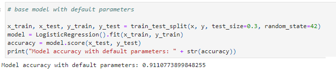

## Scikit-learn Pipeline

The SkLearn pipeline consists in use Hyperdrive to tuning the hyperparameters of LogisticRegression classifier.
The pipeline starts with a training script that loads the tabular data and apply a cleaning process to remove rows with null values and one-hot-encoding of the categorical attributes. So, the dataset is split in training and test sets, with 70-30% proportion and the LogisticRegression algorithm is execute with the hyperparameters informed by Hyperdrive. In the end, the accuracy is computed and informed to the run control, and the model is saved to disk.

The Hyperdrive config uses random sampling of parameters C and max iterations, executing in a compute cluster with 4 nodes "Standard_D2_V2" for 100 runs or maximum execution time of 30 minutes, with a policy of early termination. The primary metric used is accuracy and the hyperparameters values configured in the search are:
- C - strength of the regularization, uniform values from 0.01 to 1.0
- Max Iterations - choice between values 50,100,200 and 300

The process ran for 19 minutes, and was finished because the 100 runs were reached:

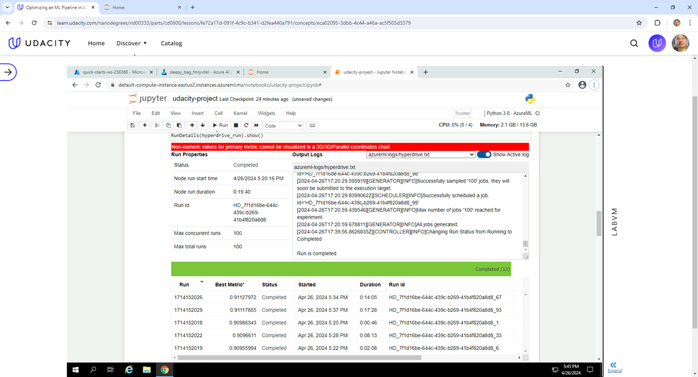

The best model found has an accuracy of 0.9114820 and have the parameters C=0.7453 and max_iter=100.

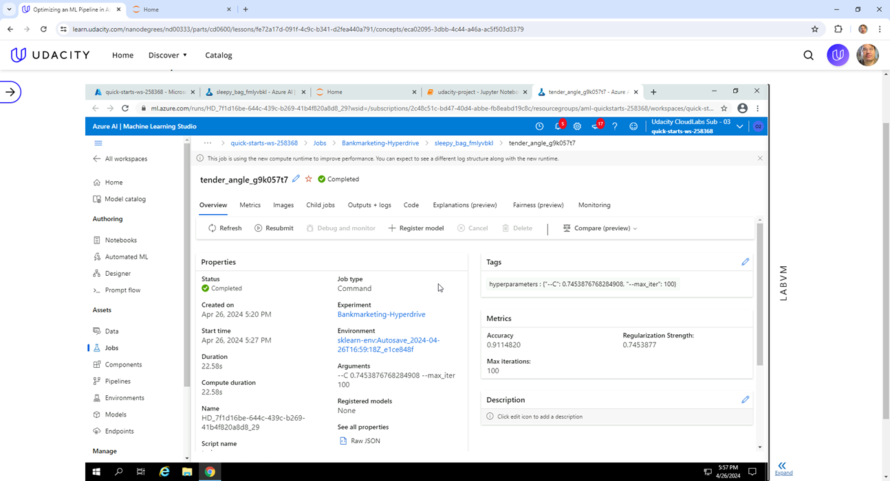

The benefits of random sampling is to reduce the search space when compared to grid search, usually bringing more speed with very close results. 
Another benefit with relation to Bayesian sampling is that it support early termination policies, allowing to stop runs that are not converging to better results.

The choosen policy was BanditPolicy, that finishes runs based on slack criteria, and a frequency and delay interval for evaluation, with the intention to stop runs that are not converging to better results, saving execution time and consumption of computing resources.
The values ​used to parametrize the policy are:
- slack_factor = 0.1 - distance from the best performance in the primary metric.
- evaluation_interval=1 - frequency policy to evaluate.
- delay_evaluation=5 - number of intervals for start the first evalution.

## AutoML

The AutoML pipeline allows to automate the search for models for the same task (classification in this case), allowing to use different learning algorithms and different hyperparameter configurations, automatically chosen and adjusted.
The auto parameters informed in the pipeline are:

- experiment_timeout_minutes=30 - maximum time of execution
- compute_target = cluster - the compute cluster to execute, with 4 nodes "Standard_D2_V2" 
- task="classification" - the machine learning task
- primary_metric="accuracy" - the metric used to compare the models and choose the best
- training_data=ds_clean -  the dataset to use, after cleaning and one-hot encoding the data
- label_column_name="y" -  the class column of the dataset
- n_cross_validations=5 - the number of cross validation partitions - 5 means 5 experiments with 80% training data and 20% test data, alternating between data segments.

Note that instead of use K-fold cross-validation, is also possible to use fixed training/test sets.

In the end of execution, the process output shows that 31 different models were used to choose the best model:

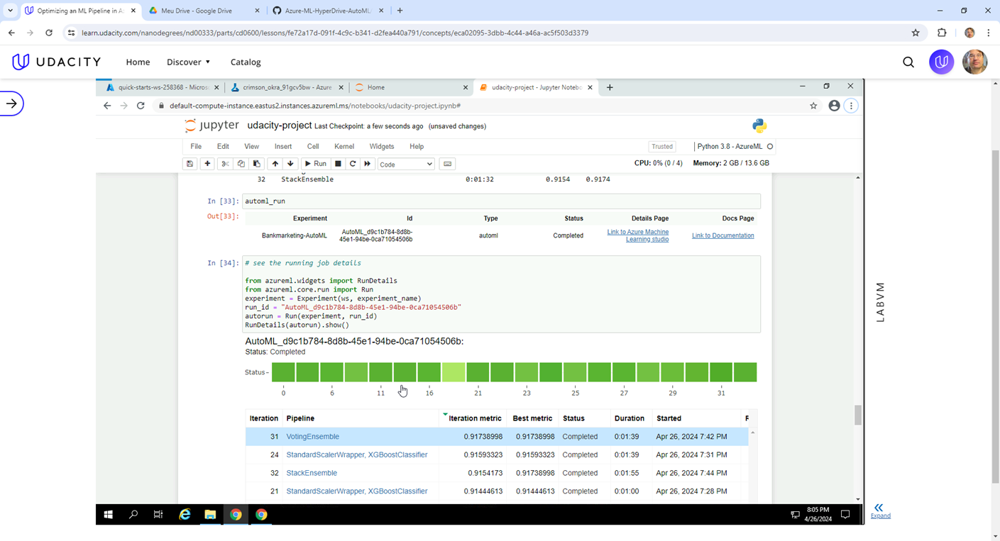

The AutoML job ran for 42 minutes and was aborted by timeout. The best model was a VotingEnsemble, with accuracy of 0.91739:

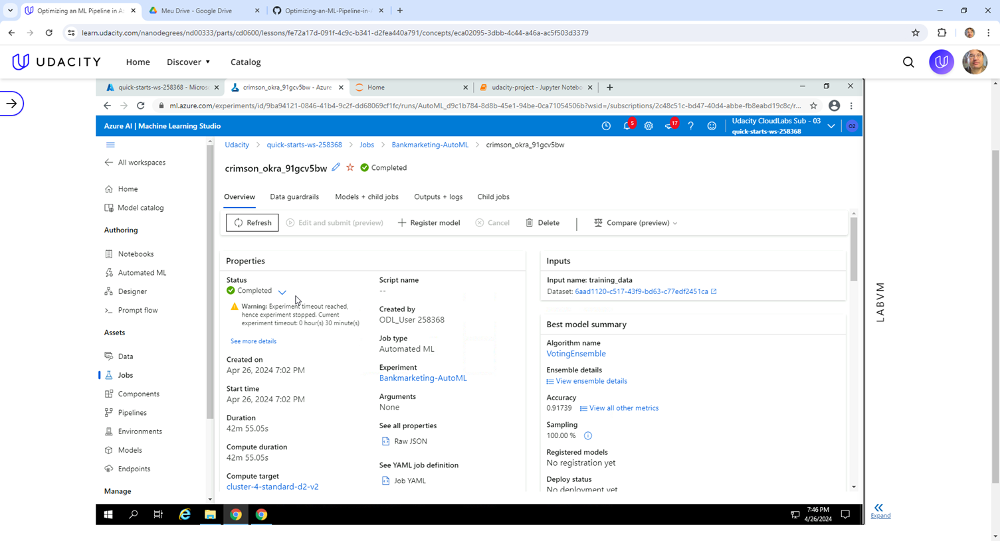

The VotingEnsemble, that combines the predictions from multiple other models, is composed of 7 classifiers, seen in the figure below:

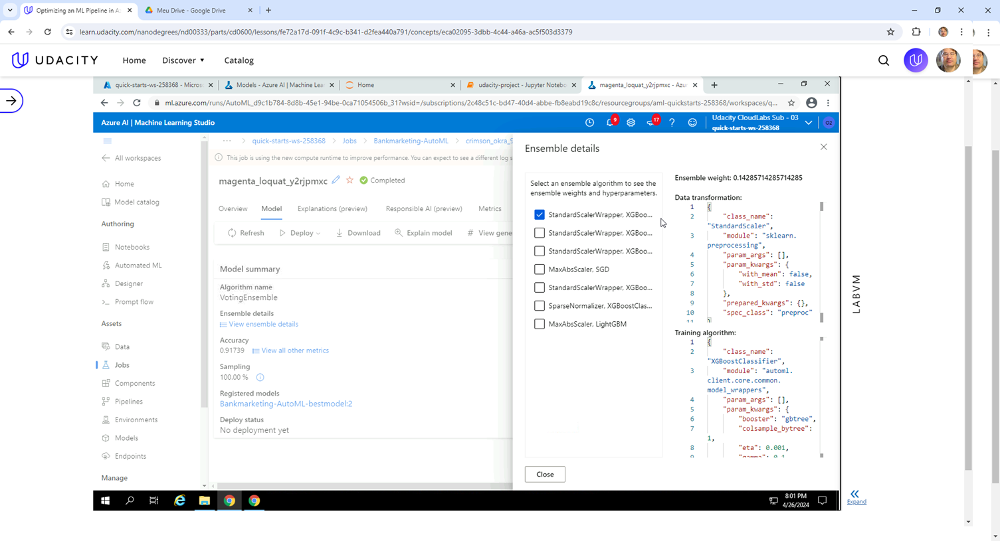

## Pipeline comparison

Comparing the Hyperdrive pipeline with AutoML pipeline, it is clear that the use of AutoML is superior in the sense of seeking solutions with different types of machine learning algorithms, whereas the Hyperdrive pipeline is for optimizing the best parameters of a fixed training procedure (LogisticRegression in this case).
Even considering the proximity of the results obtained by baseline, Hyperdrive and AutoML (0.91107 x 0.91148 x 0.91739), AutoML produces better results by testing several different types of algorithms and being able to combine them through voting.

## Future work

In the Hyperdrive experiment, is possible to use different hyperparameters values and also add new ones, between more than 10 available in the SkLearn documentation page:

https://scikit-learn.org/stable/modules/generated/sklearn.linear_model.LogisticRegression.html

One important hyperparameter to test because of the particularities of this dataset is class_weight='balanced' (the default is None).
Using this configuration, the values of y are used to automatically adjust weights inversely proportional to class frequencies in the input data.

In the AutoML experiment, it is important to run the experiment for more than 30 minutes (since de execution is aborted by timeout), and also change the primary metric, because the accuracy metric is not good for imbalanced datasets, since it is easier for the model to predict the most frequent class and have good accuracy without learning to predict the minority class.
In fact, the AutoML generates a alert about this point during the execution:

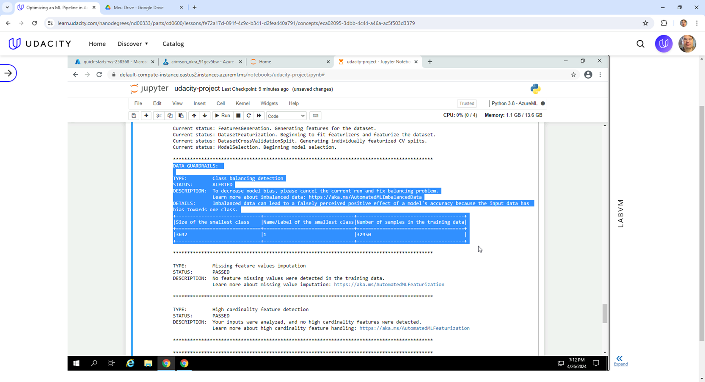

So, it is better to use AUC_weighted metric, which is the arithmetic mean of the score for each class, weighted by the number of true instances in each class.

## Proof of cluster clean up

The last cell of the notebook excludes the compute cluster:

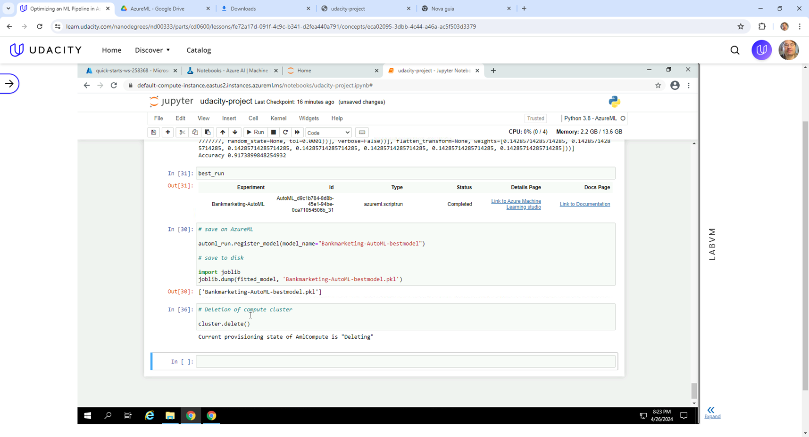

And the evidence of exclusion after the deletion request:

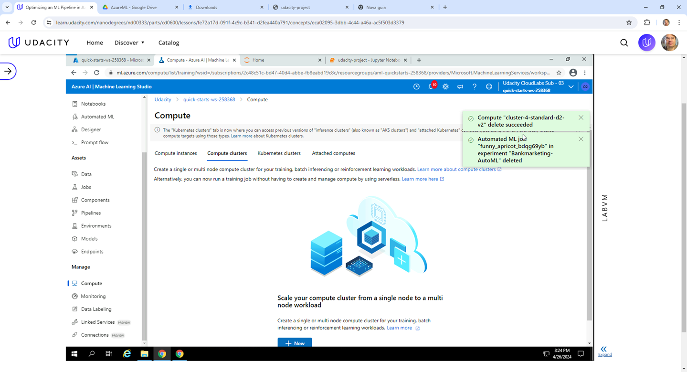
